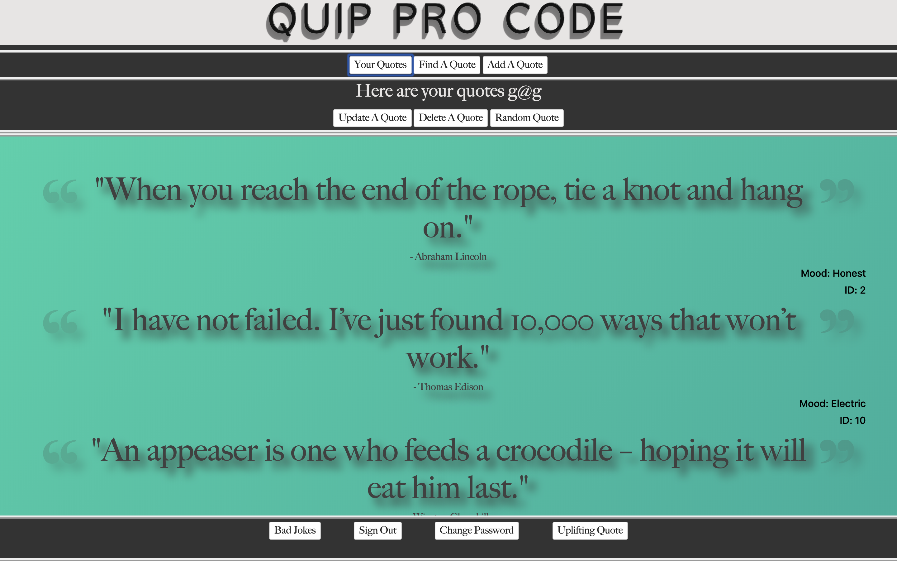
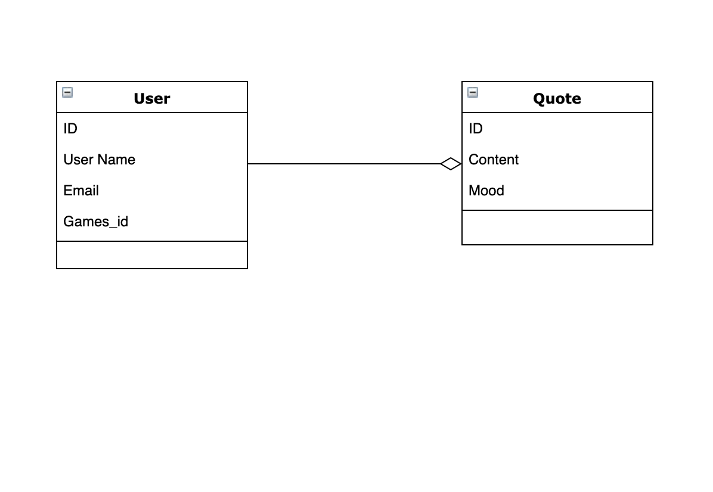

# Ruby on Rails for Quip Pro Code

This is an API I built for my second project, Quip Pro Code, at General Assembly in Boston, MA.

This API was built to recieve data for one resource with multiple parameters.

### Home Page View

## Important Links

[Quip Pro Code Client Repo](https://github.com/GMorse19/project-2-browser-GMorse.git)

[Quip Pro Code Deployed Client](https://gmorse19.github.io/project-2-browser-GMorse/)

[Quip Pro Code Deployed API](https://pacific-harbor-41390.herokuapp.com)

## Technologies Used

- Ruby on Rails

## Planning

I began the planning for this project by creating
user stories accompanied by wireframes. After I completed those, I drew up my ERD.

### ERD

Once I was comfortable with my planning, I began by scaffolding my resource into my project. I rearranged my files to include all the proper authentication and then proceeded to write curl scripts for all of my API requests.

This was the most challenging part of the project. I needed to make sure that all of the correct information was only available to the correct user. In a future version I would like to alter some of this functionality.

When I was able to get all of my curl scripts to run according to plan, I deployed my server and began the process of building my front end.

## Unsolved Problems

I'd like to grow this project to accept more parameters and resources in the future.

I would like to work on writing tests.
